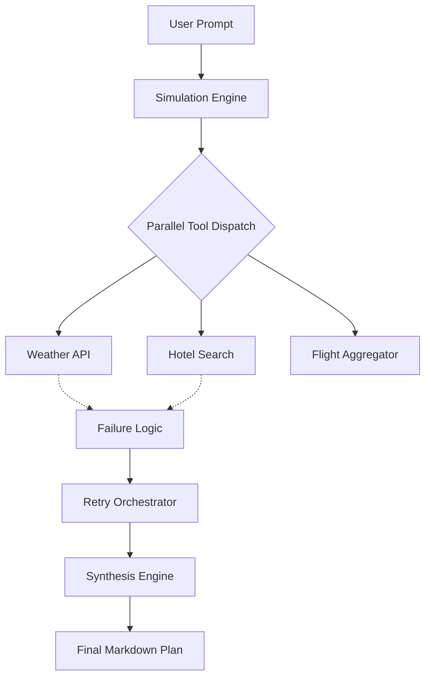

# Failure Lab: Agentic Reliability & Synthesis Visualizer

Failure Lab is a high-fidelity visualizer for monitoring and debugging agentic AI workflows. It specifically focuses on how AI agents handle tool-call failures, retries, and the final synthesis of fragmented data.

## Overview

Modern AI agents are brittle at the tool-calling layer. Failure Lab provides a "glass box" view into:
- **Parallel Execution:** How multiple tools are called concurrently.
- **Error Handling:** Real-time visualization of connection refused, timeout, and authentication errors.
- **Recovery Logic:** How agents pivot from failed tool calls to "Optimistic Synthesis".
- **Outcome Synthesis:** Final generation using high-quality LLMs (Gemini/OpenAI) to weave together partial data into a coherent plan.

## Tech Stack

- **Frontend:** React 19, Vite, Tailwind CSS
- **Visualization:** [React Flow (@xyflow/react)](https://reactflow.dev/) for the dynamic execution graph.
- **Animations:** Motion (formerly Framer Motion) for smooth state transitions.
- **State Management:** Zustand for centralized agent status and trace history.
- **Backend (Simulated):** Express.ts serving as a proxy to mimic real-world API latency and failure states.
- **Inference Engines:** 
    - Google Gemini AI (@google/genai)
    - OpenAI Node SDK

## Architecture

The app follows a unidirectional data flow:
1. **User Input:** Prompt is captured and stored in Zustand.
2. **Simulation Engine:** Orhcestrates the tool execution cycle.
3. **Execution Graph:** React Flow renders nodes representing the LLM, Tool Calls, and Synthesis Engine.
4. **Proxy Layer:** `server.ts` handles API calls, allowing for controlled injection of failures (latency, 401s, 500s).
5. **Synthesis Engine:** A final call to a "Brain" model (e.g., Gemini 1.5 Pro) to generate the user's requested content based on whatever tool data was successfully retrieved.

## Configuration

To run the full synthesis engine, you need to provide API keys in the app's sidebar:
- **Inference API Key:** Supporting Gemini (default) or OpenAI (if GPT-4o is selected).

## 🍴 Forking & Contributing

### Getting Started
1. Clone the repo.
2. Install dependencies: `npm install`
3. Run dev server: `npm run dev`

### Potential Features to Add
- **Custom Tool Definitions:** Add a JSON editor to define new tool schemas and failure probabilities.
- **Chain of Thought (CoT) Visualizer:** Expand the graph to show internal reasoning steps before tool dispatch.
- **History Replay:** Save execution traces to a database (like Firebase) to replay past failures and analyze agent "hallucination" trends.
- **Multi-Agent Support:** Visualize communication between different agent personas (e.g., Researcher and Writer).

#### Screenshots

